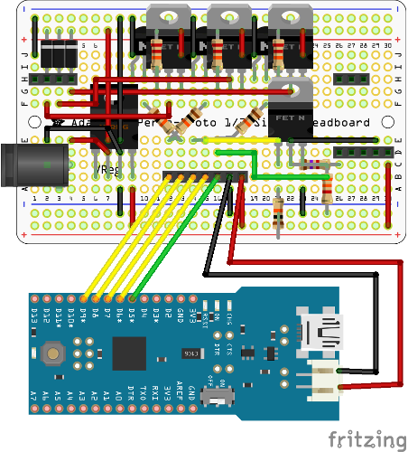

Alternative Machine Controller for RoboCup Logistics League
===========================================================

This spare time project implements an alternative controller for the machines used in the [RoboCup Logistics League Sponsored by Festo](http://www.robocup-logistics.org) (LLSF). It is in no way supported or endorsed by the league, but was developed for internal testing and for the fun of it.

The controller is based on the Arduino Fio and communicates with the referee box (refbox) via ZigBee (using XBee modules). It requires a companion board which allows for controlling the signal lights at 24V and reading RFID tags on the pucks. It uses the Seeedstudio 125 KHz RFID reader and tags for this task and not the standard tags typically used in the LLSF. The design and schematics of this board is provided as a [Fritzing](http://fritzing.org) file and shown in the image below.

Requirements
------------
- Arduino Fio:
  The Fio is used to run the control program. It has a socket for an XBee.
- XBee Modules:
  One Module for each machine and one for the refbox. For the refbox we have used the SparkFun XBee Explorer USB to host the board.
- Companion Board:
  The companion board you must built on your own. We provide schematics in the board directory with the partlist as partlist.txt.
- LLSF field equipment:
  These are in particular the light signals with metal frames (to which you need to mount the controller), the pucks, and RFID tags (125 KHz Tags matching the RFID reader).

The code has been developed using [Ino](http://inotool.org/). It allows for efficient builds and uploads from the command line and can be easily integrated with Emacs.

Running
-------
Compile and upload the code using

    ino build
    ino upload

For details on how to program the Arduino Fio cf. the [Arduino webpage](http://arduino.cc/en/Main/ArduinoBoardFioProgramming). Note that you must remove the XBee module for programming. Use Digi X-CTU to setup the XBee modules (on Linux use an older version, we have used 5.2.8.6). The module connected via the explorer USB to the refbox machine must be installed with the ZigBee coordinator API firmware (we have used version 21A7). Use the default settings. Set and remember the PAN ID (ID). Set the Node Identifier (NI) to "RefBox" (make sure there is no space at the beginning of the text field!). Next, upload the ZigBee Router API firmware to all of the field machine XBee modules. Set the PAN ID to the same value as the coordinator. Set the Node Identifier (NI) to the machine's name, e.g. M1 or D2.

Mount the XBee modules on the Arduinos and mount them to the machines with the companion board. After turning them on, they will automatically start looking for the RefBox. Once the LED on the boar turns off, a connection has been established and the machines can be used.

The Arduino pins 11 and 12 are set as a serial connection for debugging output. If you run into any problems connect with a TTL cable (3.3V!) at 9600 baud and check the output.

On the refbox, set the sps type to ArduinoXBee and the device to the serial port where the XBee Explorer USB is connected. The llsf-signal-ctrl, llsf-tool and the llsf-refbox main program will automatically pick up the new setting. Once started, you can set the lights using

    llsf-signal-ctrl -m M1 -r ON -y ON -g ON

Replace M1 by the desired machine and ON by OFF or BLINK respectively as desired.
